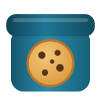

<picture>
  <source media="(prefers-color-scheme: dark)" srcset="banner-dark.svg">
  
</picture>

I pick up useful open-source tools that their authors had to leave behind and bring them back to life:
fix what broke, rewrite them for today's platforms, and ship the features users kept asking for in the
issues. The original authors are always credited, and the licenses are kept.

- 🔭 Currently working on **[Gorget](https://github.com/Perruer/gorget)**: security scanners for LLM prompts and responses, the maintained continuation of LLM Guard
- 🧩 Browser extensions for Firefox, Chrome and Edge (Manifest V3, one code base)
- ⚙️ Command-line tools in Go and Python libraries
- 🧪 Every revived project ships with end-to-end tests: real browsers, real providers
- 💡 Know an abandoned project that deserves a second life? [Tell me](https://github.com/Perruer/Perruer/issues/new)

## Projects

<table>
  <tr>
    <td width="50%" valign="top">
      
      <b><a href="https://github.com/Perruer/gorget">Gorget</a></b> 
      Python · LLM security · ONNX
       
      Scans prompts and answers of language models for prompt injection, personal data (including
      Russian documents), secrets and toxicity. Runs on CPU without PyTorch. 
      Continuation of <a href="https://github.com/protectai/llm-guard">LLM Guard</a> (3.2k★)  
      <a href="https://github.com/Perruer/gorget#install"><b>Install →</b></a>
    </td>
    <td width="50%" valign="top">
      
      <b><a href="https://github.com/Perruer/unclick">Unclick</a></b> 
      CLI · OpenTofu · Terraform
       
      Turns resources that already exist in your cloud accounts into OpenTofu / Terraform code with
      import blocks. 44 importers, plus discovery through the providers' own list resources. 
      Continuation of <a href="https://github.com/GoogleCloudPlatform/terraformer">Terraformer</a> (14.5k★)  
      <a href="https://github.com/Perruer/unclick/releases/latest"><b>Download →</b></a>
    </td>
  </tr>
  <tr>
    <td width="50%" valign="top">
      
      <b><a href="https://github.com/Perruer/notewing">Notewing</a></b> 
      Web app · PWA · works offline
       
      Markdown notes stored in your own GitHub repository. No server in between, instant search,
      images, version history. 
      Continuation of <a href="https://github.com/batnoter/batnoter">BatNoter</a> (2.4k★)  
      <a href="https://perruer.github.io/notewing/"><b>Open the app →</b></a>
    </td>
    <td width="50%" valign="top">
      
      <b><a href="https://github.com/Perruer/cookietin">CookieTin</a></b> 
      Firefox · Chrome · Edge
       
      Cookie manager and editor that sees every cookie: containers, private windows and partitioned
      cookies. Import and export in all common formats. 
      Rewrite of <a href="https://github.com/ysard/cookie-quick-manager">Cookie Quick Manager</a>  
      <a href="https://github.com/Perruer/cookietin/releases/latest"><b>Download →</b></a>
    </td>
  </tr>
  <tr>
    <td width="50%" valign="top">
      
      <b><a href="https://github.com/Perruer/wordtoast">WordToast</a></b> 
      Firefox · Chrome · Edge
       
      Translate selected text, keep a wordbook and review words with pop-up toasts. Google, DeepL,
      on-device or your own AI. 
      Rewrite of <a href="https://github.com/waynecz/dadda-translate-crx">Dadda Translate</a>  
      <a href="https://github.com/Perruer/wordtoast/releases/latest"><b>Download →</b></a>
    </td>
    <td width="50%" valign="top">
      
      <b><a href="https://github.com/Perruer/skullclick">SkullClick</a></b> 
      Firefox · Chrome · Edge
       
      Click to remove ads, pop-ups, cookie banners and any other annoying element from a web page. 
      Fork of <a href="https://github.com/rhardih/ekill">ekill</a>  
      <a href="https://github.com/Perruer/skullclick/releases/latest"><b>Download →</b></a>
    </td>
  </tr>
</table>

## Tools I use

## Support my work

All projects are free, open source and without ads. If one of them saves you time, you can support
the work on them:

<b>Crypto</b>

- **USDT / TRX (TRON, TRC-20):** `TXUBW4e88SDTfrnJRKfbhYfFcggufbonc1`
- **ETH / USDT / USDC (Ethereum, BSC, Polygon and other EVM networks):** `0x1378491169064702786b2E5b58c6375776177E8A`
- **TON / USDT (TON):** `UQAhI7EKzoa-JuKOfv0ULMzA3FrmpxsDkXj8Qevwj2z1cMRN`

A ⭐ on a project, a bug report or an idea helps too.
